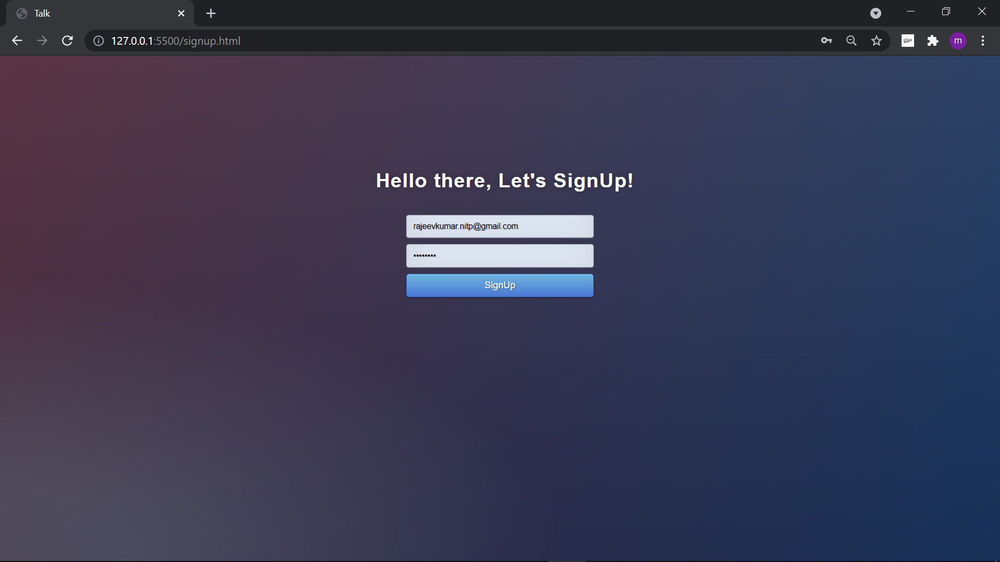
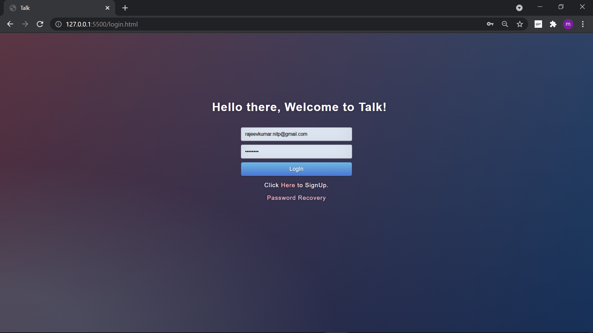
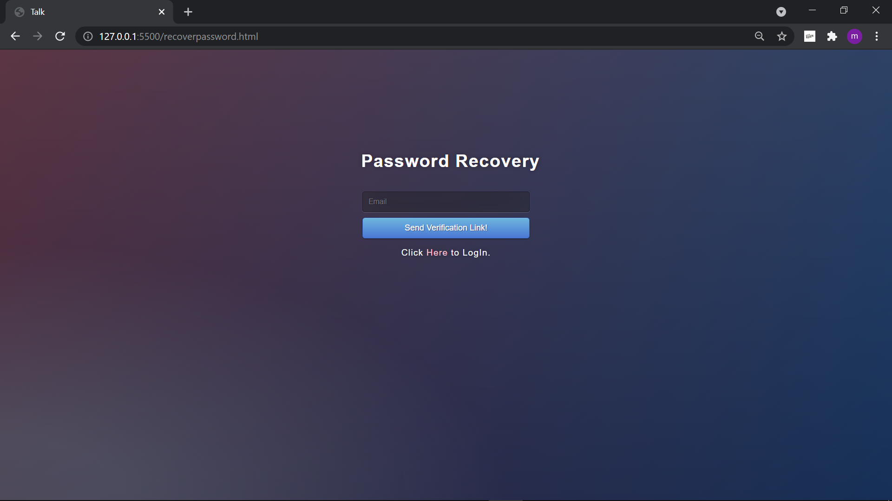
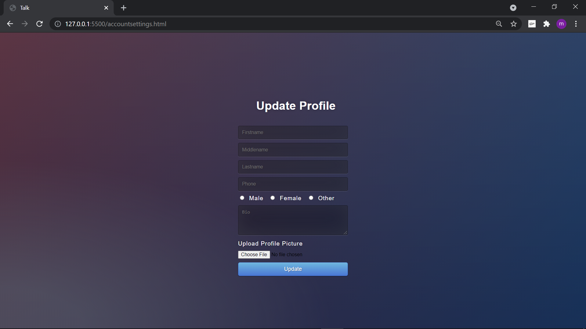
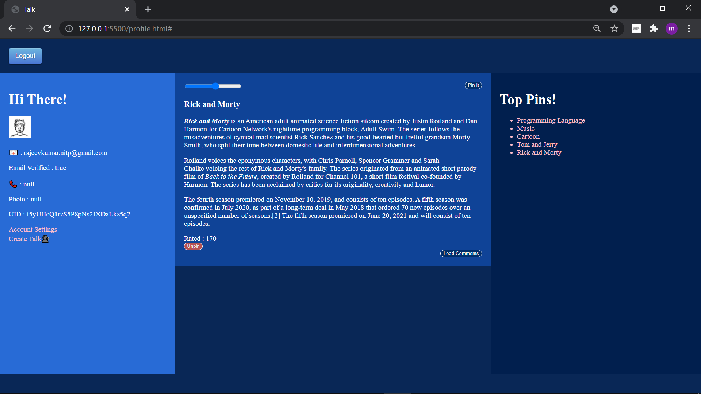
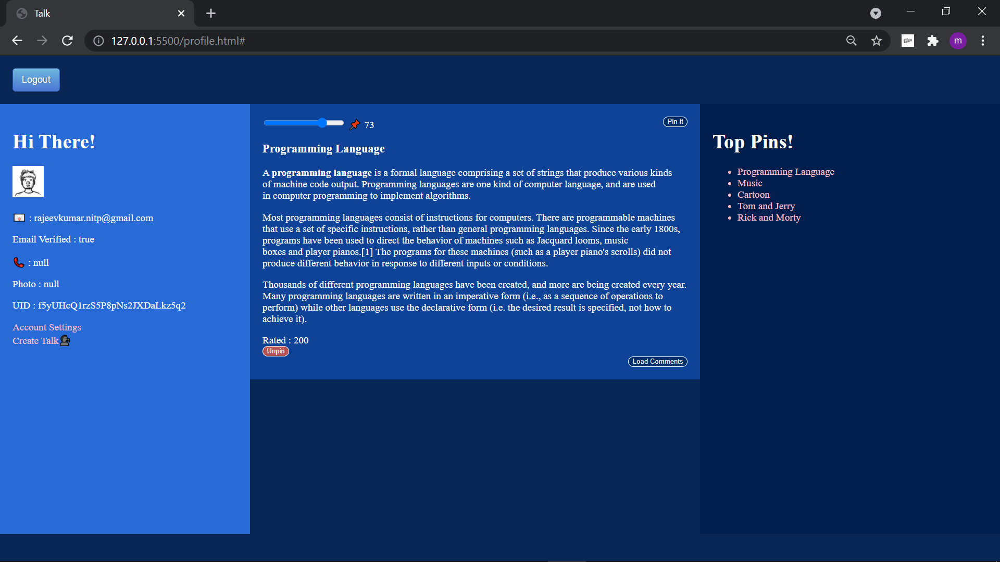
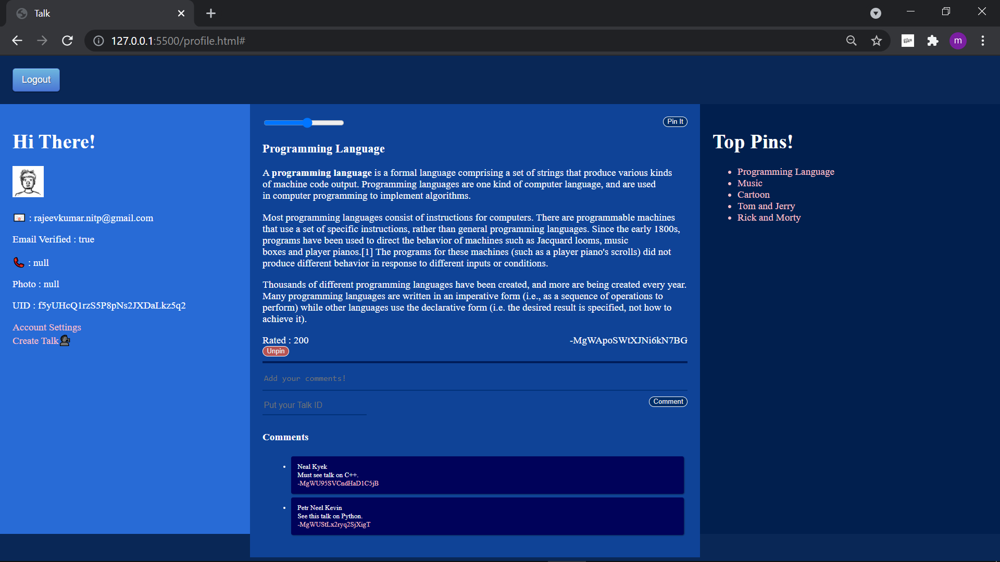
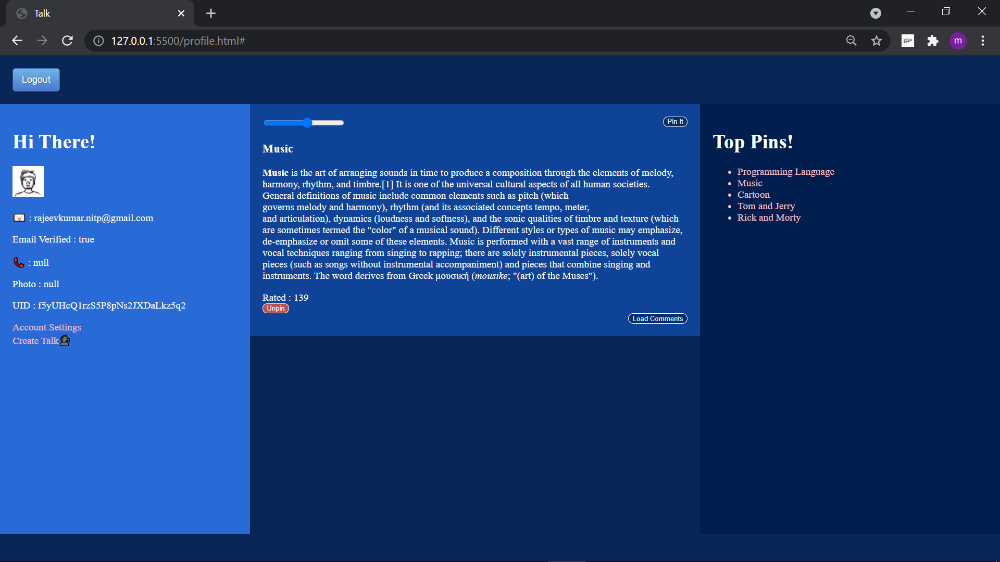

# Talk
A website to Talk!

### Benefits of using Talk!

- It's Talking by text.
- Knowledge sharing.
- Easy to use, free, and aesthetic.

## SignUp
    SignUp using any email id and then verify your email id.

## LogIn
    You must verify your email id before login.

## Password Recovery
    You can change your password by your registered email id.

## Features of Talk

### Account Setting
    You can update your basic profile details and profile photo in the account setting.

### Create Talk
    You can initiate a Talk here with a title and content.

### My Talks
    Here you can see all of your initiated Talks.

### View Talk
    You can read a Talk here.

### Top Talks
    It contains the top 5 Talks of time ranked by various raking factors not necessarily in order.

### Pin Talks
    You can pin a Talk with its pin value by using slider.

### Unpin Talks
    You can unpin/report a Talk. 

### Comments
    You can comment over a Talk to change its direction to a new Talk.

### Overall Rating
    Rated : Here you can see the overall rating of the Talk.

### USE : This web project will be online soon. See Ya :-)